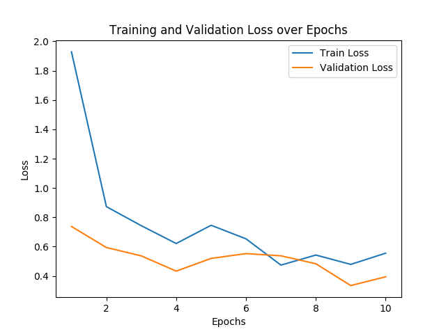
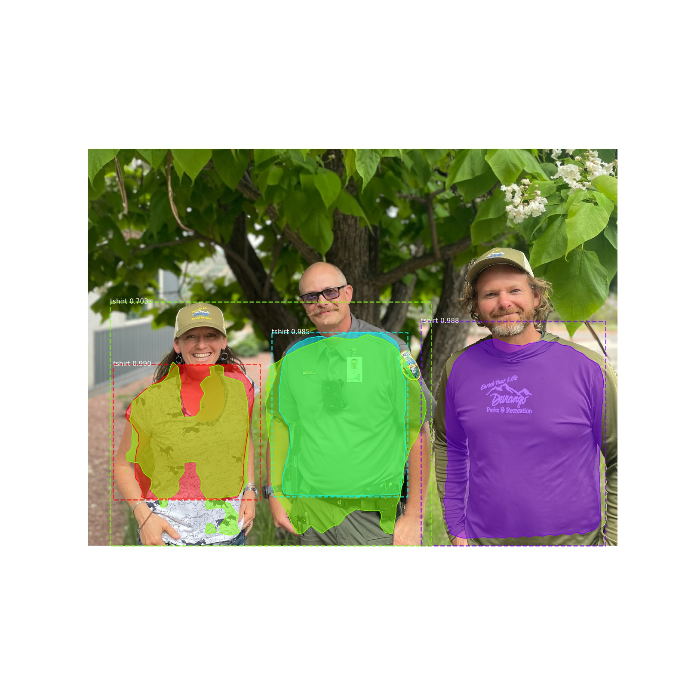
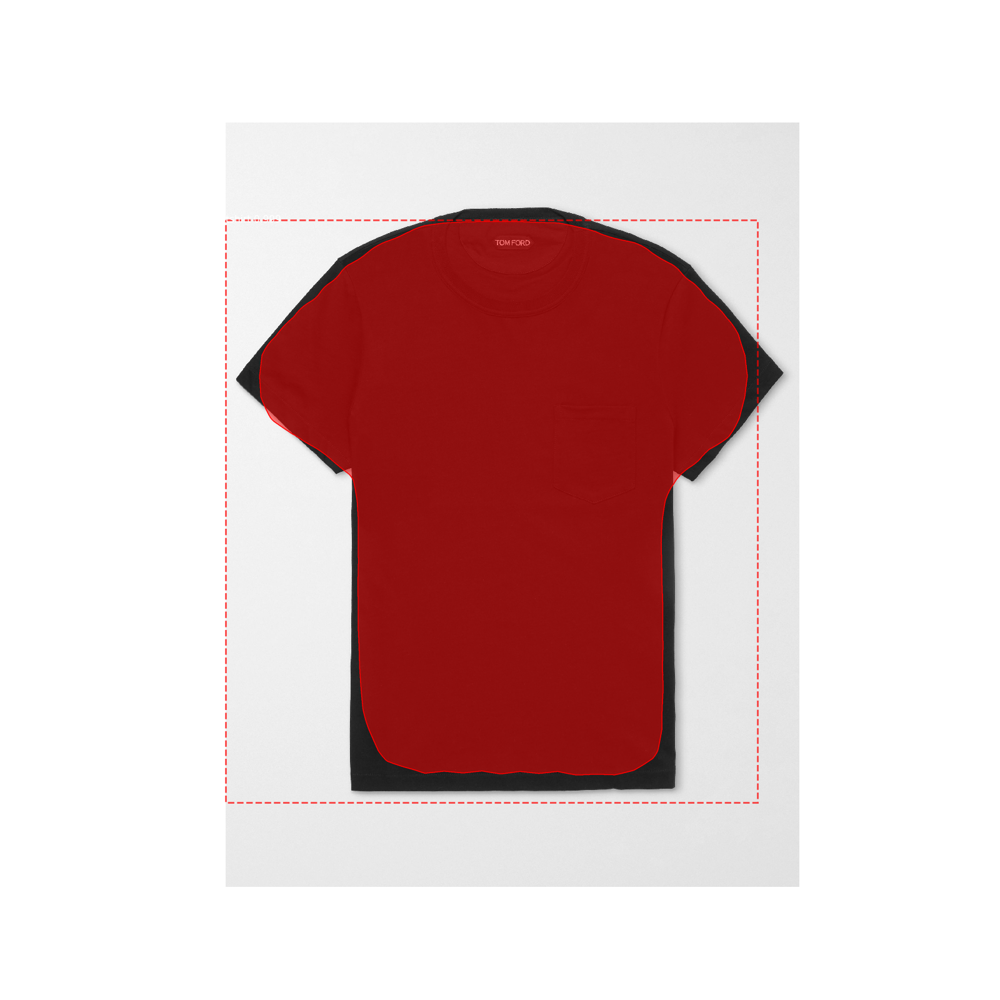

# T-shirt Detection Using Mask R-CNN

## Description du Projet
Ce projet utilise Mask R-CNN pour détecter et segmenter des T-shirts en réutilisant les poids du modèle COCO pré-entraîné et en ré-entraînant uniquement les head layers..


### Préparation de l'Environnement

Pour assurer une reproduction fiable de notre environnement de développement et vu les probèmes de compatibilité, nous avons mis en place un environnement Docker incluant toutes les dépendances nécessaires à Mask R-CNN avec les versions spécifiques qui datent de 2017. Cette approche nous permet de garantir la cohérence des versions des bibliothèques et des dépendances.
Nous avons configuré un environnement avec les versions suivantes :

- Python 3.5.4
- TensorFlow 1.5.0
- Keras 2.1.5
- Mask R-CNN (Implémentation Matterport)

1. **Construction de l'image Docker**
```bash
docker build -t tshirt-detection .
```

2. **Lancement du conteneur**
```bash
docker run -it mask-rcnn-python35
```

le Dockerfile gère automatiquement l'installation de :
- Les packages Python requis
- La bibliothèque Mask R-CNN
- Le téléchargement du modèle COCO
- Les dépendances du projet
-Les programmes python
### Dataset
- **Taille** : 202 images de T-shirts
- **Répartition** :
   Entraînement : 162 images (80%)
   Validation : 40 images (20%)
- **Format** : Masques polygonaux pour une segmentation précise 
- **Structure** : Images labélisées avec des masques polygonaux

## Structure du Projet
```
project/
├── dataset.py          # Gestion du dataset et configuration du modèle  (`CustomConfig`)
├── train.py           # Script d'entraînement
├── inference.py       # Script pour les prédictions
├── dataset/
│   ├── images/        # Images d'entraînement
│   └── annotations/   # Fichiers d'annotation JSON
└── logs/             # Logs d'entraînement et modèles sauvegardés
```

1. Les images et annotations sont chargées via `dataset.py` et on a la génération des masques pour la segmentation
2. Le Chargement et division du dataset (80% train, 20% validation) et l'entraînement du model est géré par `train.py`
```bash
python train.py
```
3. Le Chargement du modèle entraîné et les prédictions sur nouvelles images sont faites via `inference.py`
```bash
python inference.py 
```

## Hyperparamètres et Configuration
la première configuration (config1) pour l'entraînement du modèle est la suivante:
### Configuration 1 du Modèle
```python
IMAGES_PER_GPU = 1
    NUM_CLASSES = 1 + 1  # Arrière-plan + T-shirt
    STEPS_PER_EPOCH = 100
    IMAGE_MAX_DIM = 256
    IMAGE_MIN_DIM = 256
    LEARNING_RATE = 0.0001
    OPTIMIZER = 'sgd'
    EPOCHS = 10
```
Voici les differents résultats d'entrainement obtenus:

#### 1. Courbe de Perte (Loss)

Le graphe ci-dessous montre l'évolution des pertes de training loss et validation loss sur 10 époques.




La perte de validation reste inférieure à la perte d'entraînement donc notre modèle généralise bien sans overfitting.

#### 2. Dernière Ligne des Logs
Les logs complets de l'entraînement sont sauvegardés dans deux fichiers :
- training_logs.txt : Enregistre spécifiquement les losses et validation_losses de chaque époque (dans config1/training_logs.txt)
```
Epoch 7, Loss: 0.474196954369545, Validation Loss: 0.5376814070343972
Epoch 8, Loss: 0.5429598882049322, Validation Loss: 0.4835761894285679
Epoch 9, Loss: 0.47915269307792185, Validation Loss: 0.3347528874874115
Epoch 10, Loss: 0.5557353990525007, Validation Loss: 0.39468212202191355
```
- log.txt : Contient tous les détails d'entraînement dans config1/log.txt
Voici les derniers logs d'entraînement (Époque 10) :
```
 93/100 [==========================>...] - ETA: 1:52 - loss: 0.5784 - rpn_class_loss: 0.0215 - rpn_bbox_loss: 0.2328 - mrcnn_class_loss: 0.0207 - mrcnn_bbox_loss: 0.1109 - mrcnn_mask_loss: 0.1926
 94/100 [===========================>..] - ETA: 1:36 - loss: 0.5751 - rpn_class_loss: 0.0213 - rpn_bbox_loss: 0.2312 - mrcnn_class_loss: 0.0206 - mrcnn_bbox_loss: 0.1105 - mrcnn_mask_loss: 0.1916
 95/100 [===========================>..] - ETA: 1:20 - loss: 0.5760 - rpn_class_loss: 0.0211 - rpn_bbox_loss: 0.2332 - mrcnn_class_loss: 0.0204 - mrcnn_bbox_loss: 0.1108 - mrcnn_mask_loss: 0.1904
 96/100 [===========================>..] - ETA: 1:04 - loss: 0.5713 - rpn_class_loss: 0.0209 - rpn_bbox_loss: 0.2310 - mrcnn_class_loss: 0.0202 - mrcnn_bbox_loss: 0.1102 - mrcnn_mask_loss: 0.1890
 97/100 [============================>.] - ETA: 48s - loss: 0.5674 - rpn_class_loss: 0.0208 - rpn_bbox_loss: 0.2292 - mrcnn_class_loss: 0.0201 - mrcnn_bbox_loss: 0.1093 - mrcnn_mask_loss: 0.1879 
 98/100 [============================>.] - ETA: 32s - loss: 0.5641 - rpn_class_loss: 0.0206 - rpn_bbox_loss: 0.2273 - mrcnn_class_loss: 0.0200 - mrcnn_bbox_loss: 0.1093 - mrcnn_mask_loss: 0.1869
 99/100 [============================>.] - ETA: 16s - loss: 0.5597 - rpn_class_loss: 0.0204 - rpn_bbox_loss: 0.2254 - mrcnn_class_loss: 0.0198 - mrcnn_bbox_loss: 0.1085 - mrcnn_mask_loss: 0.1856
100/100 [==============================] - 1709s 17s/step - loss: 0.5557 - rpn_class_loss: 0.0202 - rpn_bbox_loss: 0.2235 - mrcnn_class_loss: 0.0197 - mrcnn_bbox_loss: 0.1078 - mrcnn_mask_loss: 0.1845 - val_loss: 0.3947 - val_rpn_class_loss: 0.0094 - val_rpn_bbox_loss: 0.1267 - val_mrcnn_class_loss: 0.0123 - val_mrcnn_bbox_loss: 0.1065 - val_mrcnn_mask_loss: 0.1396
```

#### 3. Exemples de Détection

On a utilisé le modèle entrainé sur de nouveaux images de test voici le résultat:
<div style="display: flex; justify-content: center; gap: 30px;">
    
    
</div>


Pour explorer des possiblités d'amélioer ces résultats on a remplacé SGD par l'optimiseur Adam voici la nouvelle configurations

### Configuration 2 et 3 du Modèle
Nous avons testé deux configurations supplémentaires avec un learning rate plus élevé (0.01) en utilisant 'Adam' et 'SGD':

```python
# Configurations 2 et 3
IMAGES_PER_GPU = 1
NUM_CLASSES = 1 + 1
STEPS_PER_EPOCH = 50
EPOCHS = 10
IMAGE_MAX_DIM = 256
IMAGE_MIN_DIM = 256
LEARNING_RATE = 0.01
OPTIMIZER = 'adam' puis OPTIMIZER = 'sgd'  # Testé avec les deux optimiseurs
```

Ces configurations avec un learning rate plus élevé (0.01 vs 0.0001 de la première config) ont conduit à une divergence du modèle. À partir de l'époque 7, nous avons obtenu des valeurs 'NaN' pour la loss, indiquant une explosion du gradient.
```
Epoch 1, Loss: 1.8442893350124359, Validation Loss: 1.3141049003601075
Epoch 2, Loss: 1.3648225152492524, Validation Loss: 0.8775486958026886
Epoch 3, Loss: 1.2045146095752717, Validation Loss: 1.3633794105052948
Epoch 1, Loss: 1.825877447128296, Validation Loss: 1.2739704883098601
Epoch 2, Loss: 1.1321923249959946, Validation Loss: 1.1798729169368745
Epoch 3, Loss: 1.1944658493995666, Validation Loss: 2.631324108839035
Epoch 4, Loss: 1.4473659992218018, Validation Loss: 1.1461294502019883
Epoch 5, Loss: 0.8068634074926376, Validation Loss: 1.1516182518005371
Epoch 6, Loss: 1.6554887092113495, Validation Loss: 1.370980622768402
Epoch 7, Loss: nan, Validation Loss: nan
Epoch 8, Loss: nan, Validation Loss: nan
Epoch 9, Loss: nan, Validation Loss: nan
Epoch 10, Loss: nan, Validation Loss: nan
```


